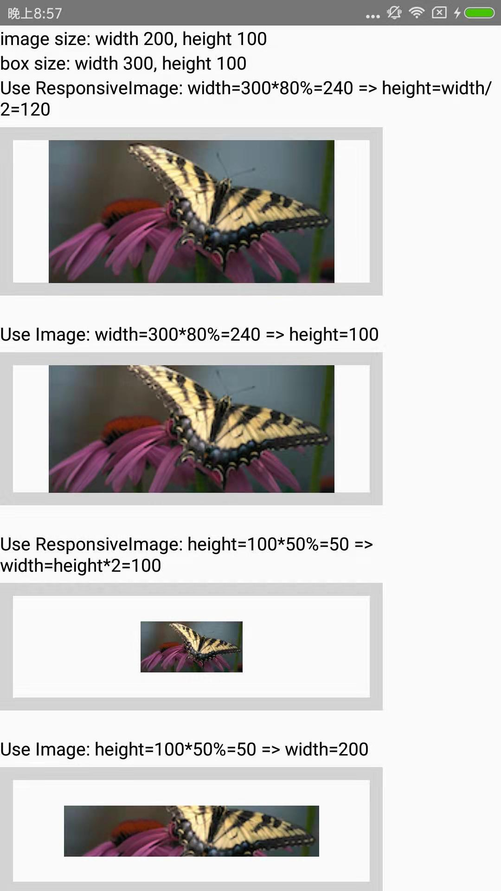

# react-native-responsive-image

you can just set one of width or height, then another will responsive by image ratio.

## Installation

`$ npm install @unpourtous/react-native-responsive-image --save`

## Usage

screen shot:




source code:
```jsx harmony
import React from 'react'
import {
  ScrollView,
  View,
  Text,
  Image
} from 'react-native'
import ResponsiveImage from '@unpourtous/react-native-responsive-image'

export default class Demo extends React.Component {
  render () {
    return <ScrollView>
      <Text>image size: width 200, height 100</Text>
      <Text>box size: width 300, height 100</Text>
      <Text>Use ResponsiveImage: width=300*80%=240 => height=width/2=120</Text>
      <View style={{
        marginTop: 5,
        marginBottom: 20,
        width: 300,
        borderColor: 'lightgray',
        borderWidth: 10,
        justifyContent: 'center',
        alignItems: 'center'
      }}>
        <ResponsiveImage
          source={require('./test.png')}
          width={'80%'}
        />
      </View>
      <Text>Use Image: width=300*80%=240 => height=100</Text>
      <View style={{
        marginTop: 5,
        marginBottom: 20,
        width: 300,
        borderColor: 'lightgray',
        borderWidth: 10,
        justifyContent: 'center',
        alignItems: 'center'
      }}>
        <Image
          source={require('./test.png')}
          style={{
            width: '80%'
          }}
        />
      </View>
      <Text>Use ResponsiveImage: height=100*50%=50 => width=height*2=100</Text>
      <View style={{
        marginTop: 5,
        marginBottom: 20,
        width: 300,
        height: 100,
        borderColor: 'lightgray',
        borderWidth: 10,
        justifyContent: 'center',
        alignItems: 'center'
      }}>
        <ResponsiveImage
          source={require('./test.png')}
          height={'50%'}
        />
      </View>
      <Text>Use Image: height=100*50%=50 => width=200</Text>
      <View style={{
        marginTop: 5,
        marginBottom: 20,
        width: 300,
        height: 100,
        borderColor: 'lightgray',
        borderWidth: 10,
        justifyContent: 'center',
        alignItems: 'center'
      }}>
        <Image
          source={require('./test.png')}
          style={{
            height: '50%'
          }}
        />
      </View>
    </ScrollView>
  }
}
```

## props

- `height`: set image's height, number or string
- `width`: set image's width, number or string
- `style`: for native [View component](https://facebook.github.io/react-native/docs/view)
- other: to [Image component](https://facebook.github.io/react-native/docs/image), like `source`
